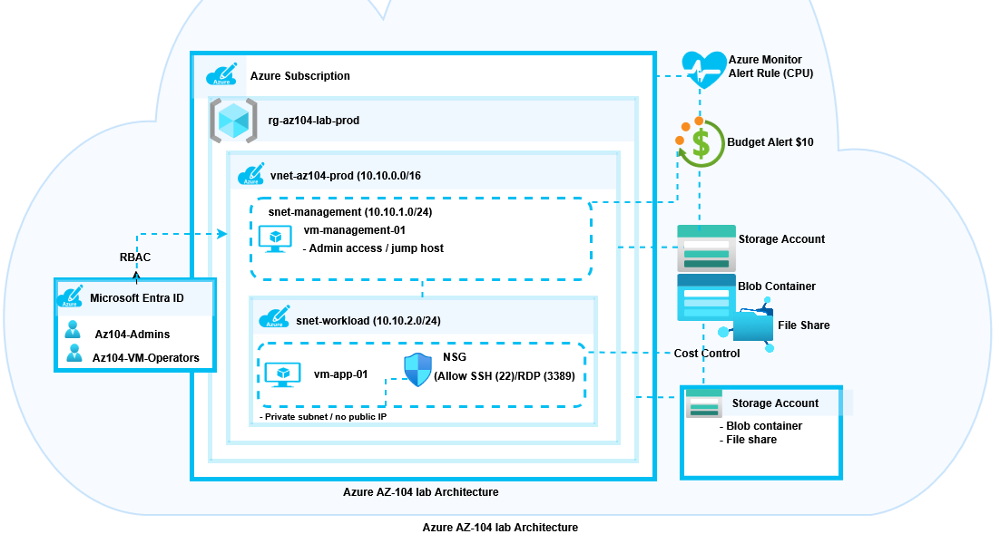
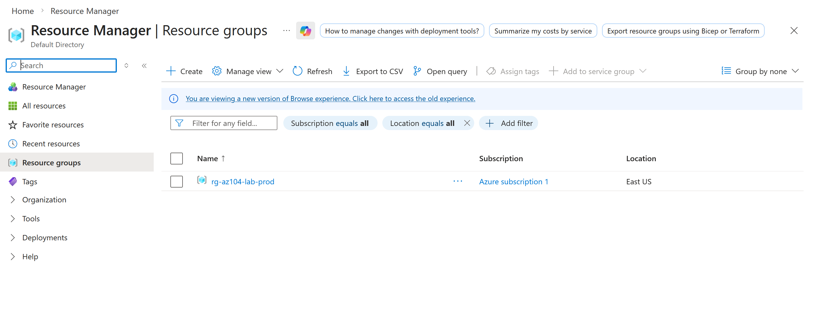
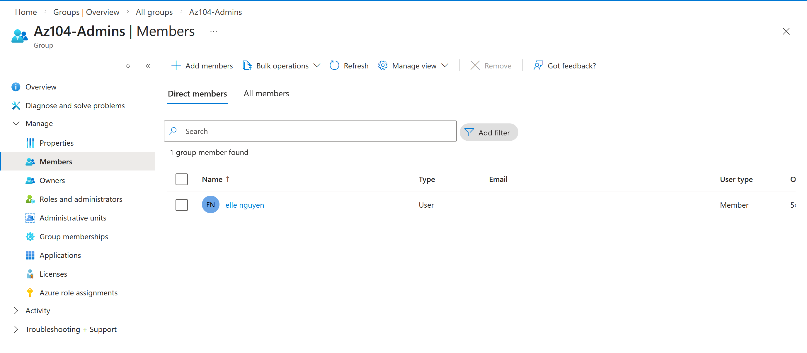
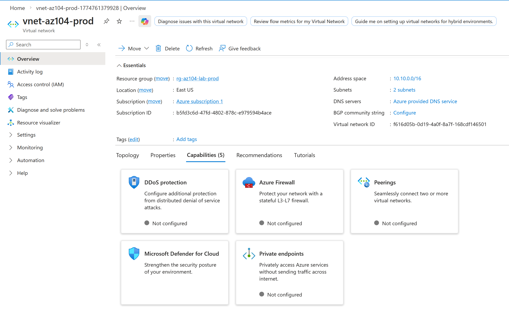
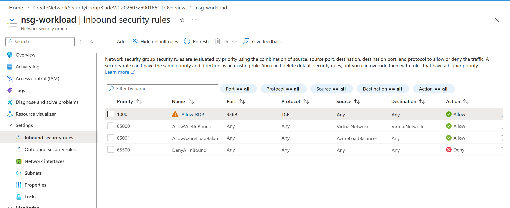
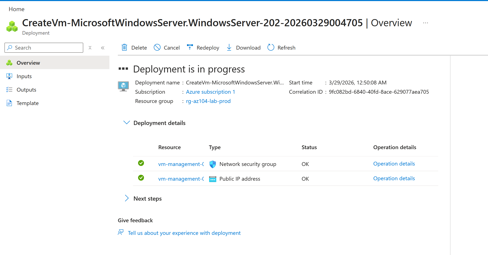
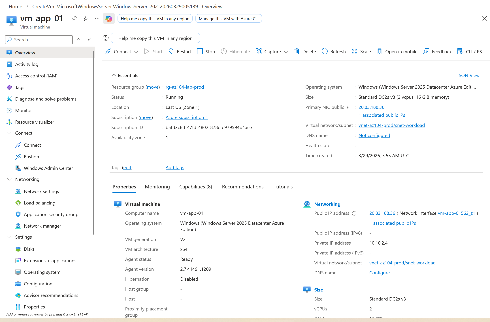
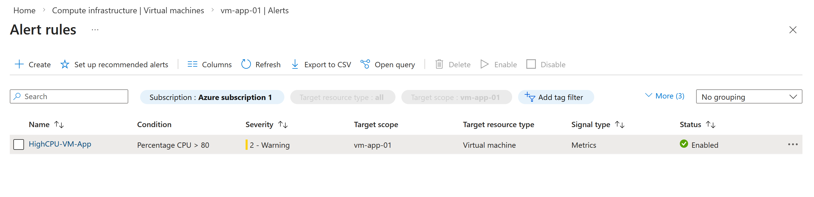
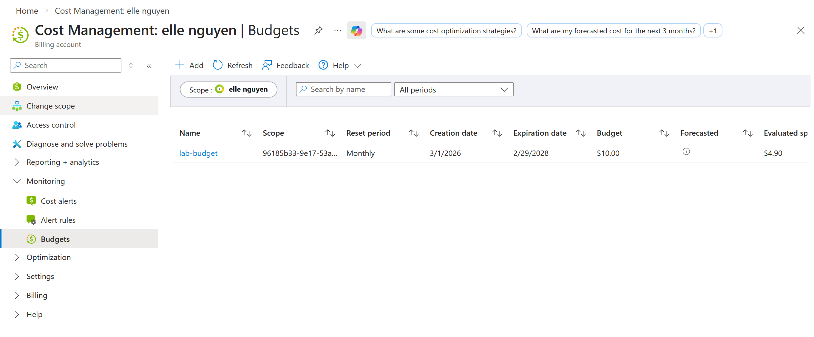

# Azure AZ-104 Admin Lab

This is a beginner Azure AZ-104 lab where I built a small production style environment to practice core administrator skills.

---

## Architecture



---

## What I built

* Microsoft Entra ID (Users, Groups, RBAC)
* Virtual Network with segmented subnets
* Management VM (jump host)
* Workload VM (private subnet)
* Network Security Group (NSG)
* Azure Monitor alert (CPU > 80%)
* Budget alert for cost control
* Azure Storage (Blob + File share)

---

## Screenshots

### Resource Group



### RBAC (Entra ID Groups)



### Virtual Network & Subnets



### Network Security Group



### Virtual Machines



### Storage Account



### Monitor Alert (CPU > 80%)



### Budget Alert



---

## 📁 Project Structure

```
az104-azure-admin-lab/
├── README.md
├── architecture/
│   └── az104-lab-diagram.png
├── screenshots/
│   ├── 01-resource-group.png
│   ├── 02-rbac.png
│   ├── 03-vnet-subnets.png
│   ├── 04-nsg.png
│   ├── 05-vms.png
│   ├── 06-storage.png
│   ├── 07-monitor-alert.png
│   └── 08-budget.png
└── docs/
    ├── project-overview.md
    ├── deployment-steps.md
    └── lessons-learned.md
```

---

## 🎯 Key Learnings

* How to structure Azure resources in a production-style setup
* Importance of network segmentation (management vs workload)
* Using NSG rules to control access
* Monitoring resources with Azure Monitor
* Managing cost using Azure budgets

---

## 🚀 Notes

This is a beginner project as I continue learning Azure and cloud infrastructure.


az104-azure-admin-lab/
├── README.md
├── architecture/
│   └── az104-lab-diagram.png
├── screenshots/
│   ├── 01-resource-group.png
│   ├── 02-rbac.png
│   ├── 03-vnet-subnets.png
│   ├── 04-nsg.png
│   ├── 05-vms.png
│   ├── 06-storage.png
│   ├── 07-monitor-alert.png
│   └── 08-budget.png
└── docs/
    ├── project-overview.md
    ├── deployment-steps.md
    └── lessons-learned.md
